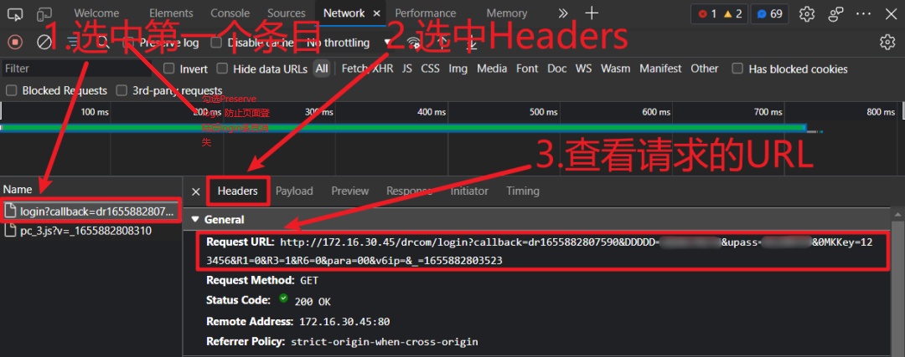

# Campus-Network-Authentication-Script   太原理工大校园网自动登陆Python脚本

## 一、校园网登陆脚本
[Pengfei196/Campus-Network-Authentication-Script: 太原理工大校园网自动登陆Python脚本](https://github.com/Pengfei196/Campus-Network-Authentication-Script)
#### 原理
经测试，理工大的网络认证有效时间为15小时，之后需要重新认证来获取Internet，如此一来，当我们需要远程连接一些24小时运行的服务器设备时，会带来不便。
认证过程非常简单，就是将当”学生号”，“密码”和“当前设备分配到的校园网IP”地址通过一个简单的加密函数加密，之后将其与其他信息统一通过一个Request Get方法发送到服务器，服务器比对数据，如果正确则登录成功。

#### 脚本特点
- 将加密函数写入了脚本，实现了网页登录的完全仿真
- 自动获取设备IP地址，可自动处理动态IP地址
- 登录方法二可避免用户密码在脚本中明文出现，保护账号安全（也可以用脚本中的加密函数得到自己账号和密码的结果，替换url中对应的值）

#### 使用方法二图示
<p align="left"></p>

## 二、Linux定时任务调度
配合Linux定时任务调度，可以防止24小时开机设备的网络中断
```bash
# 编辑crontab
crontab -e

# 在文件末尾添加以下内容：
# 每5分钟运行一次，并记录日志
*/5 * * * * /usr/bin/python3 /home/user/myscript.py >> /home/user/myscript.log 2>&1
```
